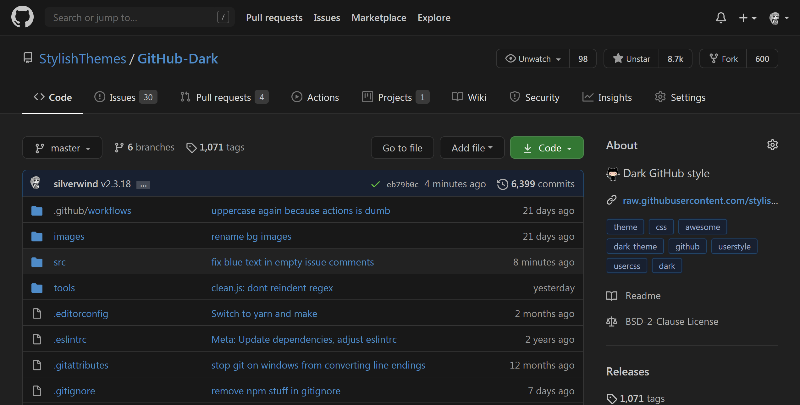

  
   
  
  
  
  
  

<h2 align="center">Your eyes will&nbsp;:heart:&nbsp;you.</h2>

# TOC
  * [Preview](#preview)
  * [Installation](#installation)
    * [Additional Userstyles](#additional-userstyles)
    * [Supported GitHub Extensions](#supported-github-extensions)
    * [Available Syntax Highlighting Themes](#available-syntax-highlighting-themes-demo)
  * [Contributions and Development](#contributions-and-development)
    * [Auto generated CSS](#auto-generated-css)
    * [Manual override entries](#manual-override-entries)
    * [Make targets](#make-targets)
  * [Notes](#notes)

## Preview

## Installation

1. Install [Stylus for Firefox](https://addons.mozilla.org/en-US/firefox/addon/styl-us/), [Chrome](https://chrome.google.com/webstore/detail/stylus/clngdbkpkpeebahjckkjfobafhncgmne), [Opera](https://addons.opera.com/en-gb/extensions/details/stylus/) or [Cascadea for Safari](https://cascadea.app/).
2. [Click here to install the](https://raw.githubusercontent.com/StylishThemes/GitHub-Dark/master/github-dark.user.css) github-dark.user.css.

## Contributions and Development

If you would like to contribute to this repository, please...

1. [ Fork](https://github.com/StylishThemes/GitHub-Dark/fork)
2. Make sure you have these installed:

- [`node`](https://nodejs.org): version 12 or greater
- [`yarn`](https://classic.yarnpkg.com/en/docs/install/): version 1
- `make`: available with UNIX-like OS, on Windows you can use [this](https://stackoverflow.com/a/54086635/808699)

3. run `make build install` to rebuild the style and install in the default browser.

Any custom changes should be done in the files in the `src` directory. Do not edit the `.css` files in the project root, these are generated.

### Auto-generated CSS

Contributing e.g. unstyled items, sources, extensions, etc. to name a few.

See and edit the respective files in [/src/gen/](./src/gen/) then run `make build install` to rebuild and reinstall the style, then test your fixes and send a pull request.

### Manual override entries

Manual overrides to e.g. generated content or inline HTML styles to name a few.

See and edit respective files in [`src`](./src) then run `make build install` to rebuild and reinstall the style, then test your fixes and send a pull request.

### Make targets

- `make deps`: Install development dependencies into `Github Dark/node_modules`
- `make build`: Build `github-dark.user.css`
- `make install`: Install `github-dark.user.css`
- `make lint`: Run linters
- `make clean`: Format source files

Lesser used targets include:

- `make authors`: Regenerate the `AUTHORS` file based on git history
- `make update`: Update dependencies
- `make`: Alias for `make build`

Internal use only targets include:

- `make patch`: Increment the patch version, create a commit and push it
- `make minor`: Increment the minor version, create a commit and push it
- `make major`: Increment the major version, create a commit and push it

## Notes

- If you're using a custom domain for GitHub Enterprise, be sure to include it through a `@-moz-document` rule (Firefox) or add it to the `Applies to` section in (Chrome).

Thanks to all our [contributors](./AUTHORS) so far! And thanks for the shoutout on the [JS Party](https://changelog.com/jsparty/20#transcript-71) podcast!

[⬆️ UP](#toc)
